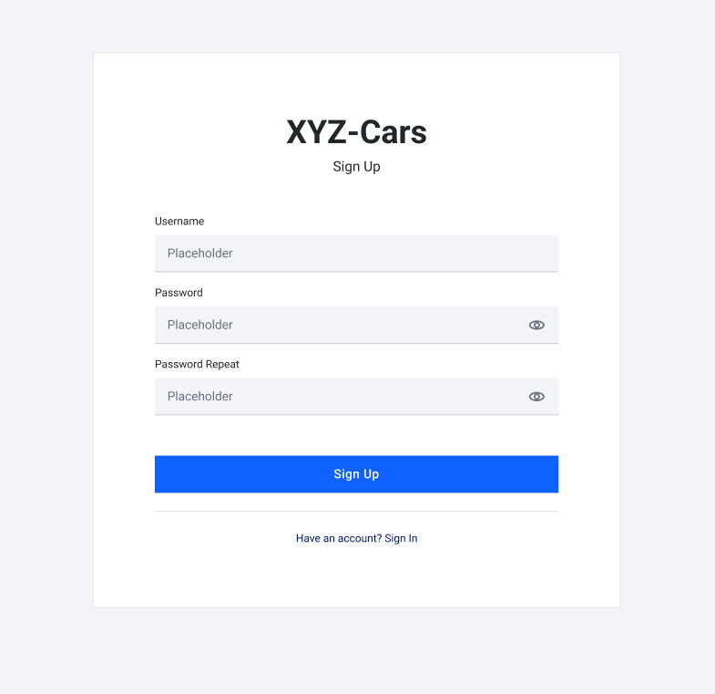
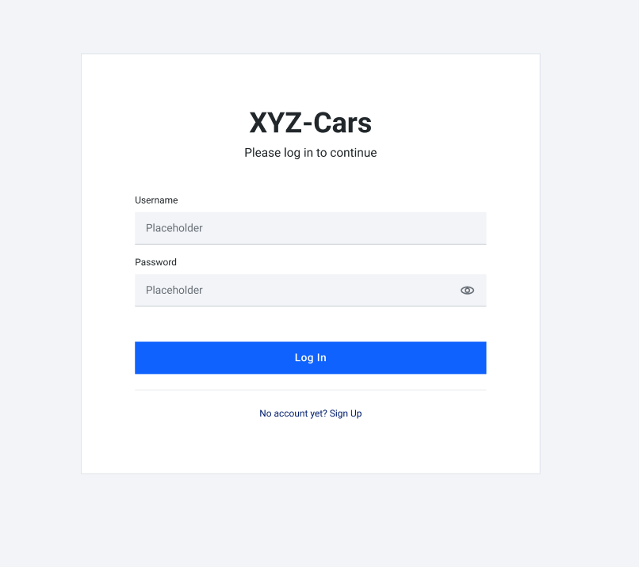
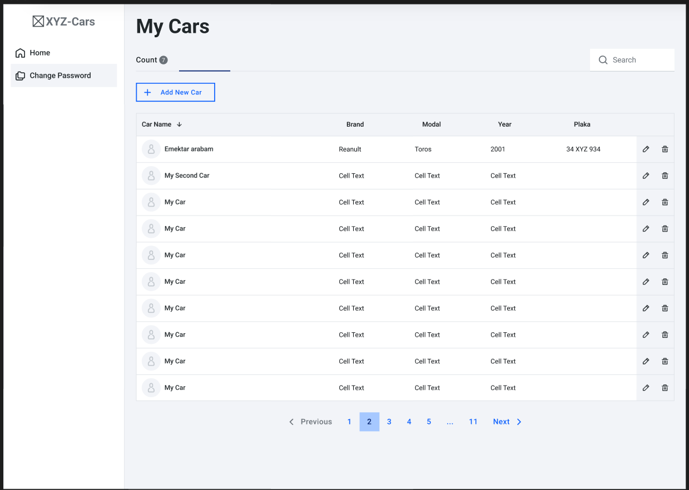
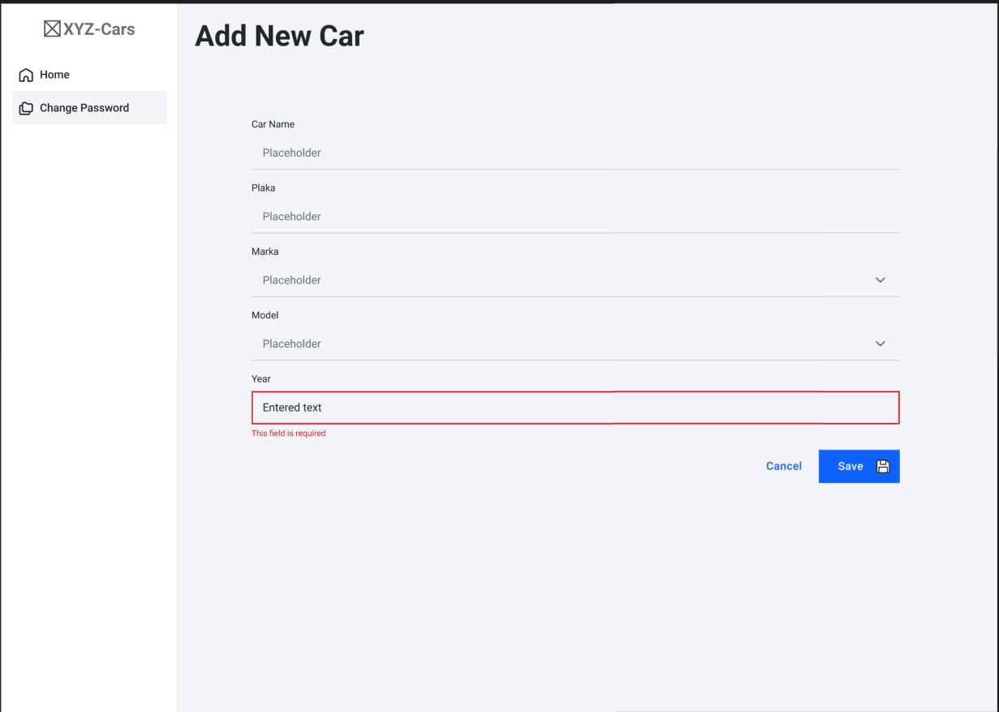
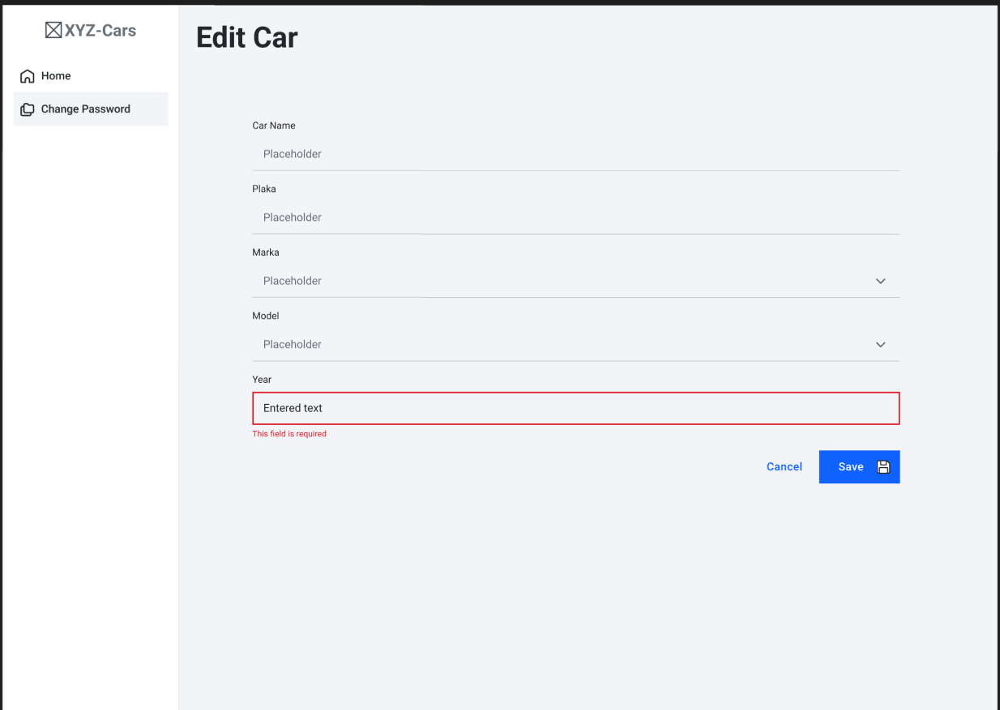
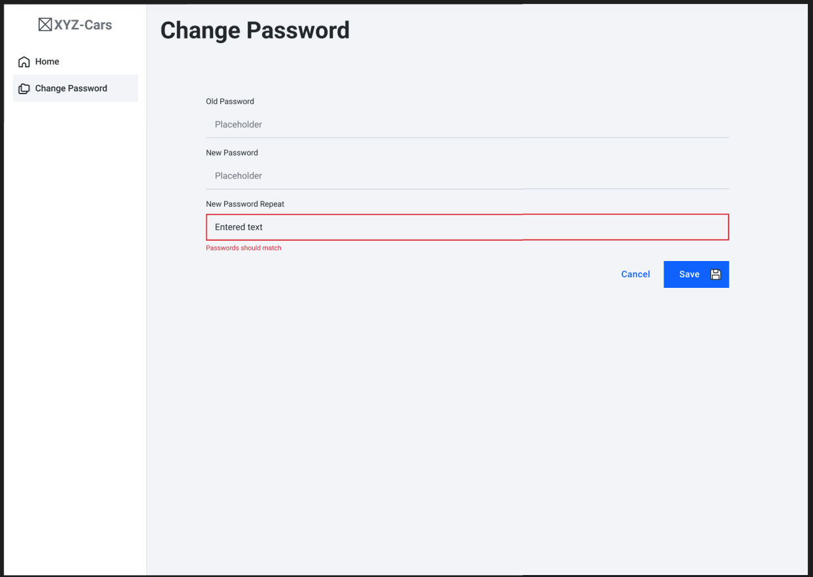

# Bitirme Projesi
## Araç Kayıt Sistemi

**Case Detayı:** 

Sisteme kayıt olan kullanıcıların kendi araçlarını sisteme ekleyebildiği bir uygulama yazılması.

**Kullanıcı:**

- Her kullanıcı, kullanıcı ad ve şifre belirleyerek sisteme kayıt olur.
- Sisteme giriş yapmayan kullanıcılar bu API'ı kullanamazlar.
- Aynı kullanıcı adı ile sisteme kayıt olunamaz.
- Kullanıcı bilgileri değiştirilemez. Sadece şifre değiştirilebilir. Şifre değiştirme işleminin yapılabilmesi için önce mutlaka login olunmalıdır.
- Şifre değiştirme işleminde eski şifrede parametre olarak alınmalıdır. (Eski şifre, yeni şifre, yeni şifre tekrar gibi)
- Kullanıcı silinebilir. Silindiğinde sistemde kayıtlı tüm araçlarıda silinmelidir.
- Kullanıcının tüm araçları sorgulanabilmelidir.

**Araç:**

- Login olmuş kulanıcılar kendi araçlarını ekleyebilirler.
- Aynı araç birden fazla kişi tarafından eklenemez.
- Plakalar boşluk, küçük harf ya da Türkçe karakter içeremez.
- Araçlar silinebilir ya da güncellenebilir.
- Marka ve modele göre araçları getiren servis yazılmalıdır.

**Not:**

- Hiçbir controller'da persistece nesne kullanılmalıdır.
- API pathlerine dikkat edilmelidir.
- Doğru hata kodlarının dönüldüğünden emin olunuz.
- Kullanıcı ve araç entitylerine eklenmesi gerektiğini düşündüğünüz bilgileri ekleyiniz. (Örneğin kullanıcı adı, soyadı vs.)

**React ile Frontend Tasarımı**

